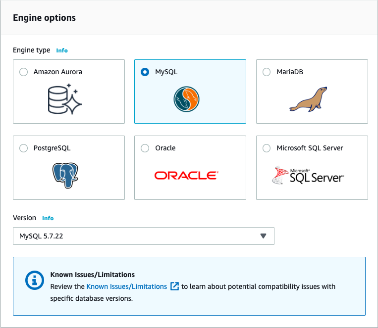
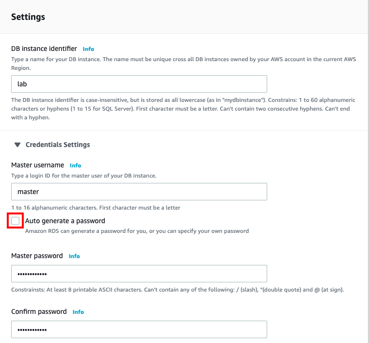
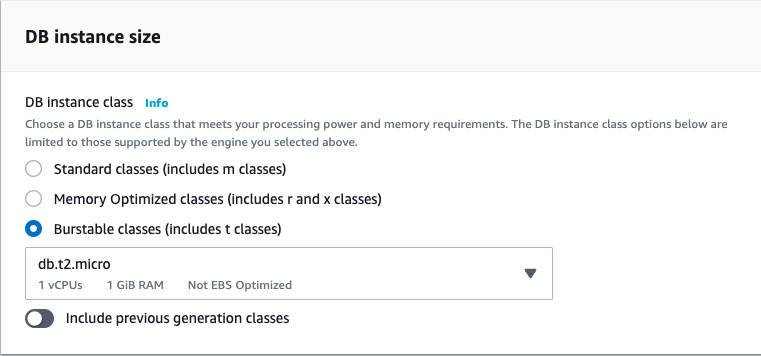
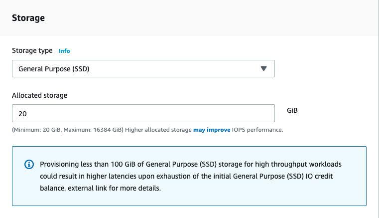
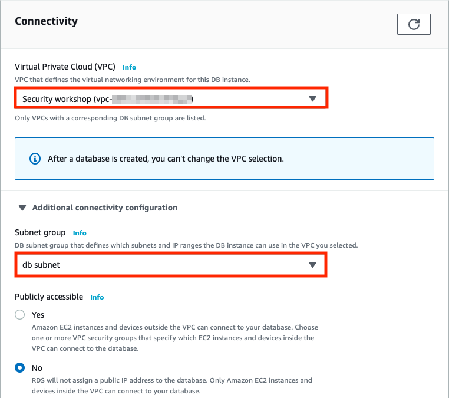
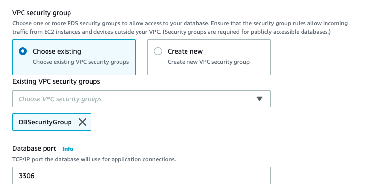

### Create Database for your web application

1. On AWS Service menu, click **RDS**.

2. On the left navigation pane, select Databases.

3. Select **Create database**.

4. Select MySQL for **Engine options**.

   

5. For Templates section, select **Production - MySQL**.

6. For the Settings section:
    * DB instance identifier: `lab`
    * Expand Credentials Settings:
    * Master username: `master`
    * **Uncheck** Auto generate a password
    * Master password: `lab-password`
    * Confirm password: `lab-password`

   

7. For the DB instance size section:
    * DB instance performance type: **check** Burstable
    * DB instance class: `db.t2.micro`

   

8. For the Storage section:
    * Storage type: `General Purpose (SSD)`
    * Allocated storage: `20` GiB

   

9. For the Connectivity section:
    * Virtual Private Cloud (VPC): **Security VPC**
    *  Expand Additional connectivity configuration
        * subnet group: **db subnet group**
        * VPC security group: check **Choose existing**
        * Existing VPC security groups:
            * **Uncheck** default
            * check **DB Security Group**

   

   

10. Expand Additional configuration:
    * Initial database name: `lab`

11. Uncheck Monitoring.

12. Scroll to the bottom of the page, uncheck the box of : **Deletion protection**.

13. Select **Create Database**, it will take **10 - 15** minutes to create your database, click **View DB instance details**, and keep refresh your webpage to check if it is done.

## Ongoing
 Go back to [Build Network environment and Web application](01Buildenvironment/01BuildNetworkenvironmentandWebapplication/README.md) -- *Create EC2 for Web Application*