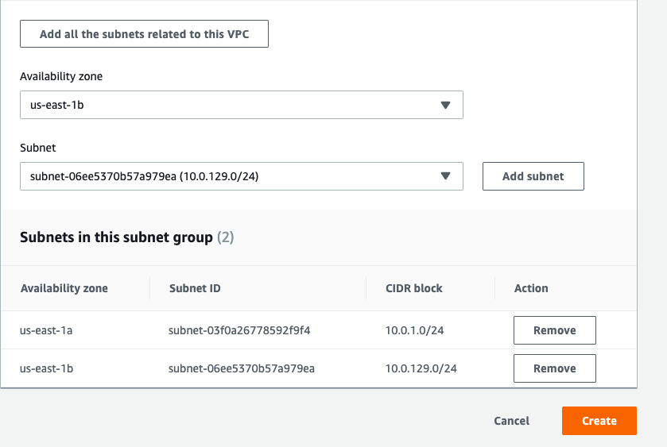
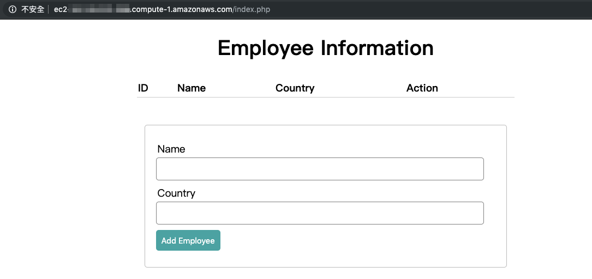
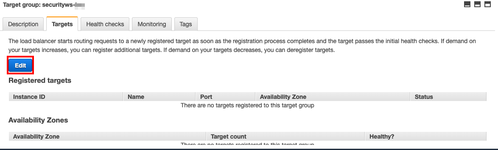
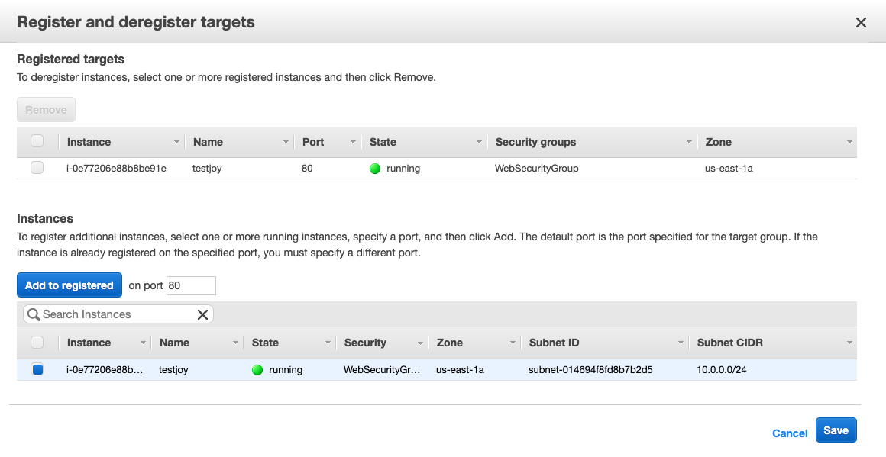
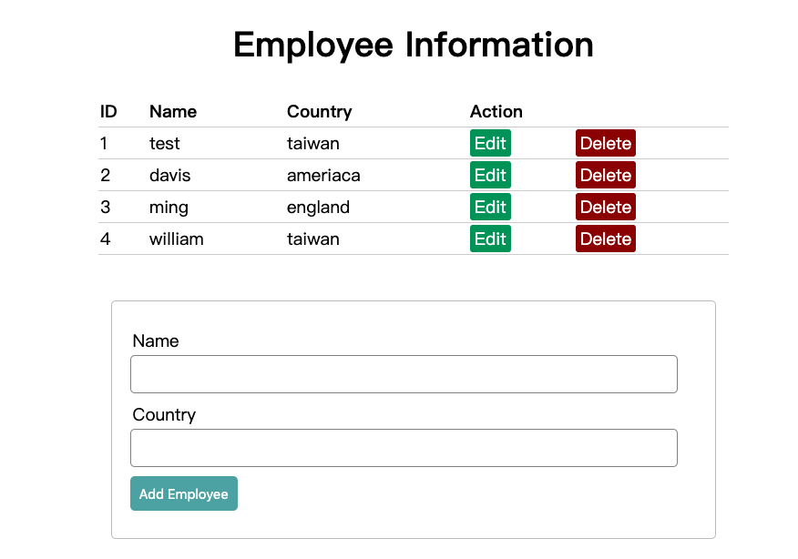

## Build Network environment and Web application

In this tutorial, we will show you how to get started with Amazon CloudFormation, Amazon EC2, Amazon RDS using AWS Console.

## Prerequisite

* Make sure the region is **US East (N. Virginia)**, which its short name is **us-east-1**.

## Lab tutorial

### Using CloudFormation to create your network environment.

1. On service menu, select **CloudFormation**.

2. Click **Create Stack**.

3. On Prerequisite - Prepare template, select **Template is ready**.

4. On Specify template, click **Upload a  template file** -> **Choose file**.

5. Select **Security_workshop.yml** you downloaded -> **Next**.

6. Enter `securityws-yourname` as stack name and **Next**.
    > Replace yourname as your name.

7. **Next** -> Click **Create** until you see stack status **CREATE_COMPLETE**.


### Create Database for your web application

1. On the service menu, click **RDS**.

2. On the left panel, select **subnet group** and **Create DB subnet group**.

3. Enter the following information and **Create**.
    * Name : `dbsubnet-yourname`
    * Description : `subnet for db`
    * VPC : select **Security workshop vpc**
    * Add two Subnet:
        1. * Availiablity zone : **us-east-1a**
            * Subnet : Select `10.0.1.0/24` and click **Add subnet**.
        2. * Availiablity zone : **us-east-1b**
            * Subnet : Select `10.0.129.0/24` and click **Add subnet**.

<p align="center">
   
</p>

4. On the left panel, click **Databases** and **Create database**.

5. Select **MySQL** ,**next** and **Production - MySQL** in next page.

6. Complete the following settings:
    * DB instance class : `t2.micro`
    * Storage type : `Genaral Perpose(SSD)`
    * Allocated storage : `20` GiB
    * DB instance identifier : `lab-db`
    * Master username : `master`
    * Master password : `lab-password`
    * Confirm password : `lab-password`

7. In the next page, input the following settings:
    * VPC : select **Security workshop VPC**
    * Subnet group : `dbsubnet-yourname`
    * VPC security groups : Choose **existing VPC security groups** *Remove Default* and select **DB-Security-Group**
    * Database name : `lab`
    * Deletion protection : discheck the box

8. Click **Create database**.

It will take four or five minutes to create your database, refresh your webpage to check if it is done.

9. Open your database and remember database endpoint look like this `lab-db.citytbhrxxx5.us-east-1.rds.amazonaws.com`.

### Create S3 bucket to store your webpages

0. Edit file -- **index.php**
    * Replace **your RDS endpoint** with <RDS endpoint\> 

1. On Service menu, click **S3**

2. Click **Create Bucket**.

3. Name and region:
    * Bucket name: `yourname-sws`

4. **Create**.

5. Click **Upload**.

6. Select the file **index.php** and upload.

7. After uploaded, select Permissions -> Public access settings, discheck all the boxes and select Save.

8. Click to get in the three files you upload, and select Make Public.

### Create EC2 for Web Application

1. On the service menu, click **EC2** and **Launch Instance**.

2. Select **Amazon Linux AMI 2018.03.0 (HVM), SSD Volume Type** the second one in Quickstart and click **Select**.

3. Leave anything as default and **Next: Configure Instance Details**.

4. At the **Configure Instance Details** part, fill in these configurations:
    * Network: `Security workshop VPC`
    * Subnet: `security Public Subnet1`
    * Auto-assign Public IP: **Enable**

5. Scroll down to the buttom of the page, expand **Advanced Details**, and paste the script below into **User data** :

    ```
    #!/bin/bash
    exec > >(tee /var/log/user-data.log|logger -t user-data -s 2>/dev/console) 2>&1
    # Install Apache Web Server and PHP 
    yum install -y httpd24 php56 php56-mysqlnd mysql git
    # Download web files
    wget wget https://s3.amazonaws.com/<yourbucket>/index.php
    wget https://raw.githubusercontent.com/williamlin0504/php/master/style.css
    mv index.php /var/www/html/
    mv style.css /var/www/html/
    # Turn on web server 
    chkconfig httpd on 
    service httpd start
    ```
    > Replace <yourbucket\> as **your bucket name**.


6. Select **Next: Add Storage** -> **Next: Add Tags** and **Add Tag**.
    > Remember to change yourname to your name.
    * Key : `Name`
    * Value : `securityws_yourname` 

7. **Next: Configure Security Group** :
   *  Select an existing security group : **WebSecurityGroup**

8. Select **Review and Launch** -> **Launch**.

9. You can **Choose an existing key pair** or **Create a new key pair**, **Click** I acknowlege...., and **Launch Instances**.

Because we have launch the instance with a user data, it might take 3 - 5 minutes to launch.

### Check the web page which display the data in your RDS

1. Wait until the instance **Staus Check** turns to **2/2**.

2. Copy and paste the **Public DNS (IPv4)** to a new browser.

3. You should be able to see this web page which display the data in your database:
<p align="center">
   
</p>

4. Enter some employee information in this database.

### Create CloudFront and Application Load Balancer for Web Application

1. In EC2 Console, on the left panel, click **Target Groups**.

3. Select the target group just look like *secur-ALBTa-ABCDSXXX34* created and on bottom of the page click Label **Targets** and **Edit**.

<p align="center">
   
</p>

4. Select your EC2, click **Add to registered** and **Save**.

<p align="center">
   
</p>

5. On the service menu, click **CloudFront**.

6. **Create Distribution** and **Get started**.
    * Origin Domain Name : Select load balancer cloudformation created for you
    > load balancer look like this *secur-Appli-ABCDE0I3ULI3-123456789.us-east-1.elb.amazonaws.com*

7. **Create Distribution** and it might take 15 minutes to launch.

8. Until you see status is **Deployed** and state is **Enabled**, you can open a new tab and paste the Domain name like this **a2b1cd09ded3yz.cloudfront.net** and you can see your web page.

<p align="center">
   
</p>

## Conclusion
Congratulations! We now have learned how to:
* integrate EC2 with RDS
* Speed Up Your Website with Amazon CloudFront

## Clean Resources
To avoid excessive billing, please delete the following resources when you have finished your practice.

* Delete your RDS instance
* Terminate your EC2 instance
* Diasble and Delete CloudFront
* Delete the Stack in CloudFormation
* Delete Target Group in EC2 Load Balancers
* The file you upload to S3 and buckets.

## Ongoing
[Use AWS Inspector inspect EC2](01Buildenvironment/02UseAWSInspectorinspectEC2/README.md)