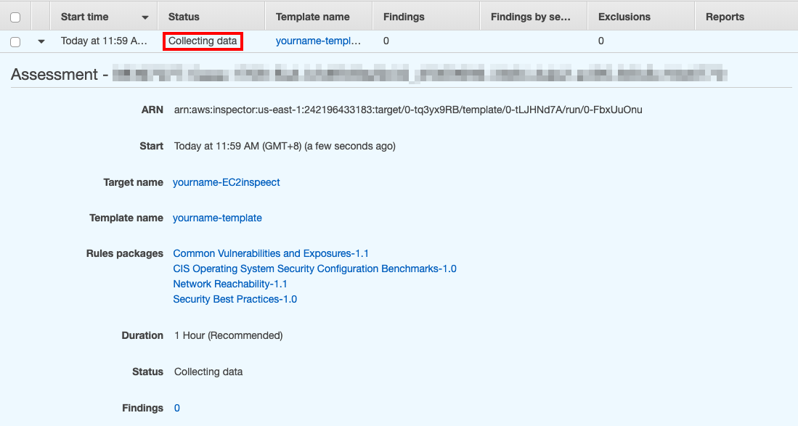

# Use AWS Inspector inspect EC2

[AWS Inspector](https://aws.amazon.com/tw/inspector/) is **a security assessment tool** does a wide variety of security assessment tests on the IT resources and generate detailed reports on it. It automatically assesses applications for **exposure, vulnerabilities, and deviations from best practice**. After performing an assessment, AWS Inspector produces a detailed list of security findings prioritized by level of severity. These findings can be viewed directly or as part of detailed assessment reports which are available via Amazon Inspector console or API.

With Amazon Inspector, you can automate security vulnerability assessments throughout your development and deployment pipelines or for static production systems in order to make security testing a regular part of development and IT operations.

## About this lab

### Scenario
In this lab, you will install the Agent on a Linux-based EC2 Instance and evaluate your instance  using AWS Inspector.

## Prerequisites
* Make sure you are in **US East (N. Virginia)**, which short name is **us-east-1**.

## Lab tutorial

1.  On the Service menu, click **EC2** 

2. Select EC2 you created for web application, on the top of the page click **Actions** and **Connect**.

3. Start Connecting. If your computer is windows, [use PuTTY to Connect to EC2 Linux Instance (Windows)](https://gitlab.com/ecloudture/knowledge-base/aws-sop/connect-to-ec2-linux-instance?nav_source=navbar#21-use-putty-to-connect-to-ec2-linux-instance-windows).If your computer is Linux or macOS, [use SSH to Connect to EC2 Linux Instance](https://gitlab.com/ecloudture/knowledge-base/aws-sop/connect-to-ec2-linux-instance?nav_source=navbar#22-use-ssh-to-connect-to-ec2-linux-instance-linux-macos).
 

8. After connecting. Start **download** the agent to your instance.
```
wget https://inspector-agent.amazonaws.com/linux/latest/install
```

9. install Inspector agent.
```
sudo bash install
```

10. Run Inspector agent.
```
sudo /etc/init.d/awsagent start
```

11. Go back to AWS EC2 console and select your EC2 instance.

12. On the bottom of the page, click label **Tags** and **Add/Edit Tags**.

13. **Create Tags** and **Save**.
    * Key : `App`
    * Value : `AWS Inspector`

14. On the service menu, click **Inspector**, **get started** and **advanced setup**.

15. Enter Name with `yourname-EC2inspect`.
    > Remember to replace your name with your name
    * Unclick include all EC2 instances in this AWS account and region.
    * Key : select **App**
    * Value : select **awsinspect**

16. Enter name : `yourname-template`.
    > Remember to replace your name with your name

17. Click **Next** and **Create**.

18. Make sure your status is collecting data and it will take an hour to inspect your EC2.
<p align="center">
   
</p>

19. After an hour, come back to Inspector console and you will see results as photo.
<p align="center">
   
</p>

20. You can see some results say your security gourp has some problem.

<p align="center">
   
</p>


## Conclusion
Congratulations! We now have learned how to:
* install inspector agent on EC2
* use inspector to inepct EC2

## Ongoing
[Build WAF with cloudformation](/02BuildWAFwithcloudformationandTest/README.md)
