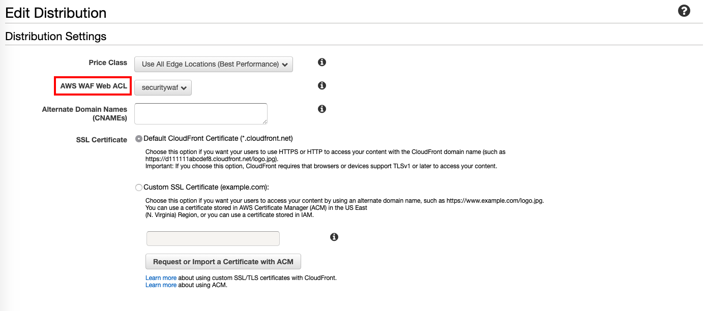
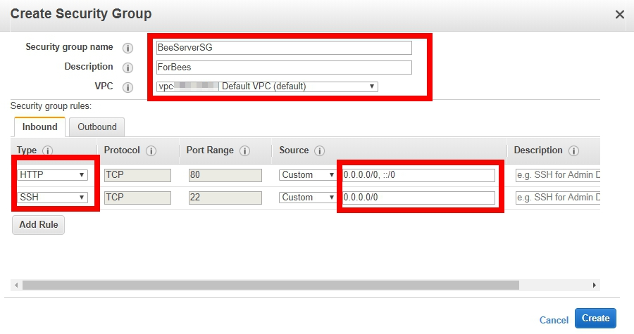
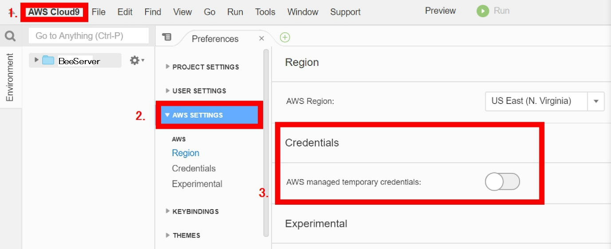
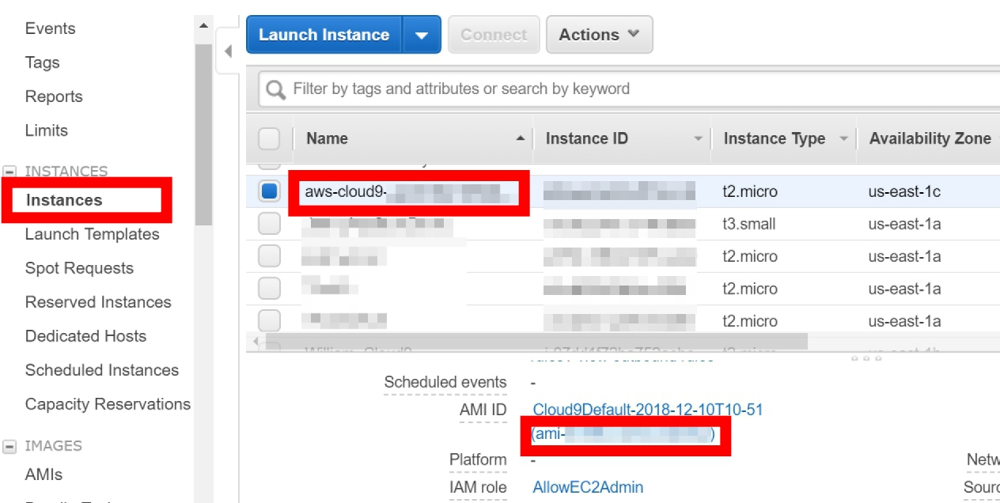
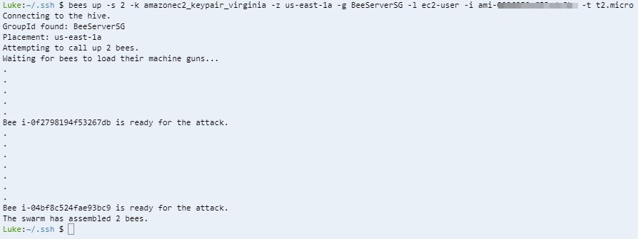
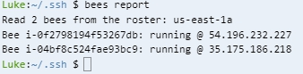
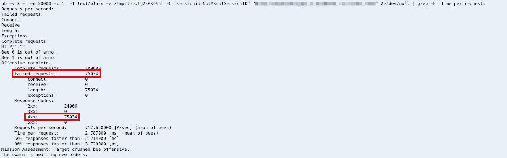
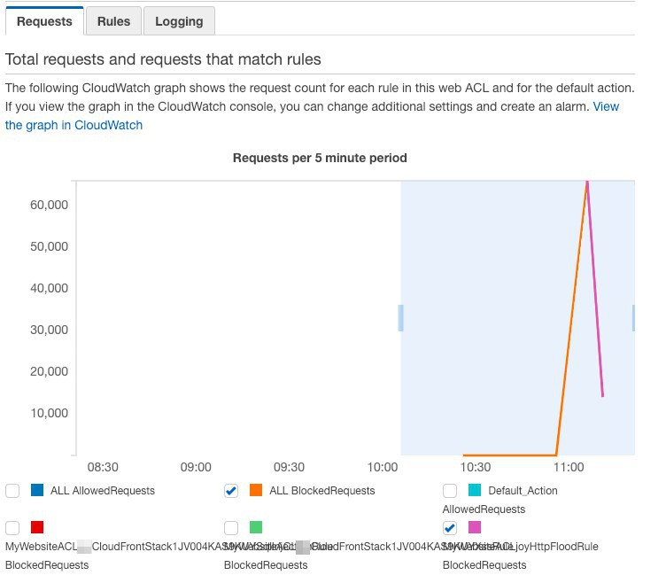
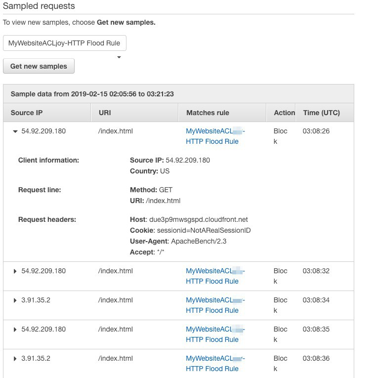

## Build WAF with  CloudFormation and Test

[AWS WAF](https://aws.amazon.com/tw/waf/) is a web application firewall that helps protect your web applications from common web exploits that could affect application availability, compromise security, or consume excessive resources.

## About this lab

### Scenario
This lab use Amazon Web Application FireWall to help you protect web application.

## Prerequisites
* Make sure you are in **US East (N. Virginia)**, which short name is **us-east-1**.

## Lab tutorial

### Create WAF for web application

1. On the service menu, click **S3**.

2. Click **Create bucket** and enter `waf-yourname` as bucket name.
> Remember to replace yourname as your name

3. Click **Create**.

4. On service menu, choose **CloudFormation**.

5. Click **Create Stack**.

6. Enter `https://s3.amazonaws.com/solutions-reference/aws-waf-security-automations/latest/aws-waf-security-automations.template` in **Specify an Amazon S3 template URL** and **Next**.

7. Specify Details and **Next**.
    * Stack name: MyWebsiteACLyourname
    * Access Log Bucket Name: waf-yourname
    > Remember to replace yourname as your name

8. Click **Next** and **Select** I acknowledge that AWS CloudFormation might create IAM resources with custom names then **Create**.

9. Wait for fifteen minutes until status is *CREATE_COMPLETE*.

10. On service menu, click **CloudFront**.

11. Select the CloudFront you created before and **Edit**.

12. On AWS WAF Web ACL : Select **WAF** you created.
<p align="center">
   
</p>

13. **Yes, Edit**.

14. Until you see status is **Deployed** and state is **Enabled**, waf is install on CloudFront.

### Test DDos Attack with Bees with machine guns

1. On the Service menu, click **EC2**.

2. In the navigation pane, click **Security Groups**.

3. Click Create **Security Groups**.

4. Input the followings:
    * Security group name : `BeeServerSG`
    * Description : `ForBees`
    * VPC : Choose Default VPC

5. Create Inbound rules :
    * Type : `HTTP`, Port Range: `80`, Source: `0.0.0.0/0`
    * Type : `SSH`, Port Range: `22`, Source: `0.0.0.0/0`

<p align="center">
    
</p>

6. On the **service** menu, click **Cloud 9**.

7. Click **Create environment**.

8. Input the **name** text : `BeeServer` , and click **Next step**.

9. In **environment settings**, leave everything as default and click **Next step**.

10. Review the name and settings, and click **Create environment**.

11. Click **AWS Cloud9** on the top list and choose **Preferences**..

12. Scroll down and click **AWS settings**.

13. Change **Credential** to **off**.

<p align="center">
    
</p>

14. On the **Service** menu, click **EC2**.
    
15. Right-click the EC2 instance named with `aws-cloud9` prefix and click **Instance Settings** -> **Attach/Replace IAM Role**. 
    > Remember the EC2 **AZ**, it is really *important*, you will use it later.

16. Click **IAM Role** and select **AllowEC2Admin**, click **Apply** to save your change.

17. On the **Service** menu, click **Cloud 9**.

18. Click **File** on the top and select **Upload local file**.

19. Click **Select files** and Select your **Keypair**. 
    > **Notice** that Cloud 9 is base on Linux system, make sure to upload **Keypair.pem** not **.ppk**

20. Move your keypair to the right location, look at the bottom of Cloud 9 and input:
    ```
    sudo mv Keypair.pem /home/ec2-user/.ssh
    ```
    > **Replace** Keypair with your keypair.

21. Install Python-Paramiko :
    ```
    sudo yum install python-paramiko git
    ```

22. Go to tmp folder, clone **BeesWithMachineGuns** to Cloud 9

    ```
    cd /tmp
    ```

    ```
    sudo git clone https://github.com/newsapps/beeswithmachineguns.git
    ```

23. Install BeesWithMachineGuns

    ```
    cd beeswithmachineguns/
    ```

    ```
    sudo python setup.py install
    ```

24. Create .boto config

    ```
    cd /home/ec2-user/
    ```

    ```
    nano .boto
    ```

25. Input information to .boto config

    ```
    [Boto]

    ec2_region_name=us-east-1

    ec2_region_endpoint=us-east-1.ec2.amazonaws.com

    #elb_region_name=us-east-1

    #elb_region_endpoint=elasticloadbalancing.us-east-1.amazonaws.com
    ```
26. Press **Ctrl** + **X** to exit.

27. Press **Y** to save modify and press **Enter** to leave.

28. Enter the right location to generate Bees

    ```
    cd /home/ec2-user/.ssh/
    ```

    > Since we're going to generate bees, we need to check out the commands we use

    * bees up : generate bees instances on AWS
    * bees down : stop and terminate all bees on AWS
    * bees report : monitor all bees and send a report to BeeServer
    * bees attack : conduct your bees to attack a target!

    > *bees up* \
    -s : number of bees \
    -k : keypair name \
    -z : available zone \
    -g : security group name \
    -l : username \
    -i : AMI id \
    -t : instance type 


    > *bees attack* \
    -n : attack times \
    -c : participate bees number \
    -k : keypair name \
    -u : target location 

29. Generate Bees using Bees up command

    ```
    bees up -s 2 -k Keypair -z us-east-1a -g BeeServerSG -l ec2-user -i ami-xxxxxxxx -t t2.micro
    ```
    > Make sure your **a bee!** availability zone is the same with **bee server**. If is not the same, replace us-east-1a with availability zone. 

    > You can find your AMI ID in here:
    <p align="center">
    
    </p>
    


30. Wait for Bees to load their machine guns, and type `bees report` to check their status.

<p align="center">
    
</p>

<p align="center">
    
</p>

31. Test your CloudFront using bees attack command:

    ```
    bees attack -n 100000 -c 2 -k Keypair -u http://XX.XX.XX.XX
    ```
    > Replace your cloudfront addresss

32. Results : You will see some failed request and failed status code.

    <p align="center">
    
    </p>

33. After ten minutes log in to your **WAF console**, select your Web ACL and you will see the graph like this.

    > This picture shows that there were lots of request had been sent to website. Some request had been blocked because they exceeded the limitation you set for your WAF.

    <p align="center">
    
    </p>

5. Scroll down the page.

    >   You will see source ip which attacked your website and some details of attack, such as Time, Matches rule and so on.

    <p align="center">
    
    </p>


## Conclusion
Congratulations! We now have learned how to:
* use AWS Web application Firewall to protect your web

## Next Level
- [GuardDuty to SNS and EBS encryption](03GuardDutytoSNSandEBSencryption/01GuardDutytoSNS/README.md)