# AWS GuardDuty to SNS

[Amazon GuardDuty](https://aws.amazon.com/tw/guardduty/) is a managed threat detection service which could intelligently protect the AWS accounts and workloads. It continuously monitors for malicious or unauthorized behaviors, such as API calls, that indicate a possible account compromise.Amazon GuardDuty is a managed threat detection service which could intelligently protect the AWS accounts and workloads. It continuously monitors for malicious or unauthorized behaviors, such as API calls, that indicate a possible account compromise.

## About this lab

### Scenario
In this lab, you will build a threat list to AWS GuardDuty using your public ip address and an AWS web server. After setting up AWS GuardDuty and active your list. Log in your server and you will see GuardDuty detect it.

## Prerequisites
* Make sure you are in **US East (N. Virginia)**, which short name is **us-east-1**.

## Lab tutorial

1. On the service menu, click **S3**.

2. Open the file **threatlist.txt** and follow steps in the document, **edit** the content.

2. Select document **threatlist** -> **uploaded** named **threatlist** and **Copy Path**.
    > Remember your path!!!
<p align="center">
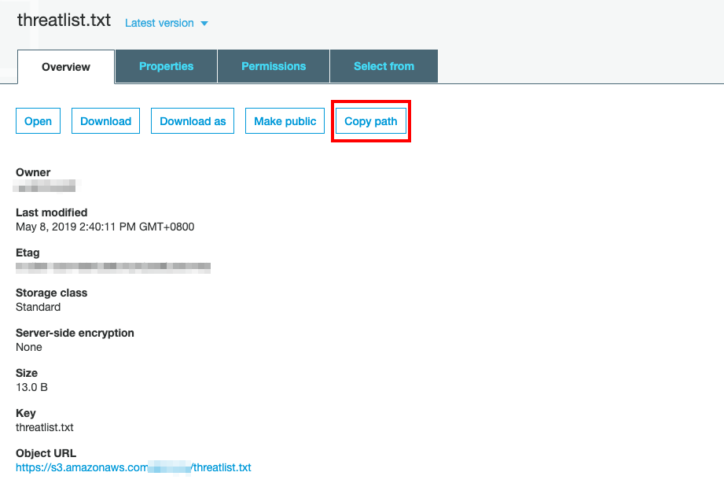
</p>

3. On service menu, select **GuardDuty**.

4. Choose **Get started** and **enable GuardDuty**, if you are new to AWS GuardDuty.
<p align="center">
   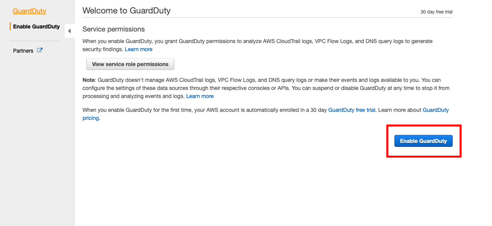
</p>

5. On the left panel, select **Lists** and **Add a threat list**.
<p align="center">
   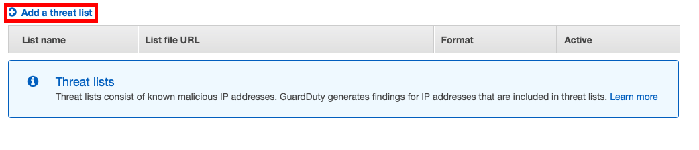
</p>

6. In **Add a threat list**,
    * For your List name, enter `threatlist_yourname`.
    * Paste the path you **Copied form S3**.
    * Drop down format menu and click **Plaintext**.
<p align="center">
   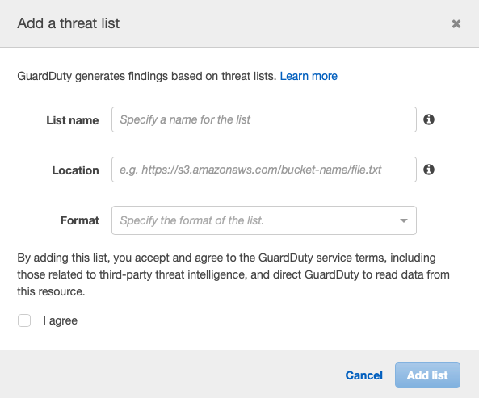
</p>

7. Click **I agree** and **add list**, until you see green check.
<p align="center">
   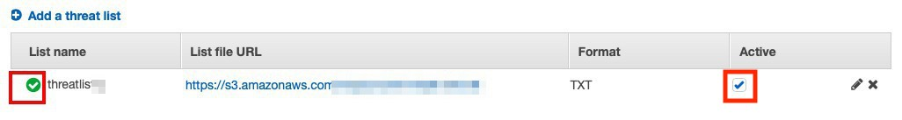
</p>

8. Wait about five to ten minutes, until the list is active.

9. Log in to your EC2.
    * With Mac, log in to your server using ssh.
    * With Windows, log in to your server with [putty](https://docs.aws.amazon.com/zh_cn/AWSEC2/latest/UserGuide/putty.html).

10. After ten minutes click Findings on the left panel, you can see how AWS web console access is detected by GuardDuty.

<p align="center">
   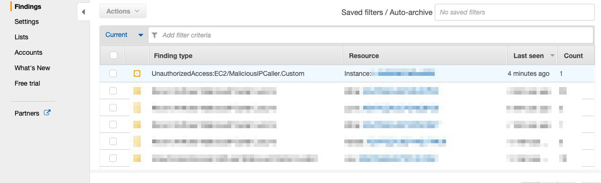
</p>

<p align="center">
   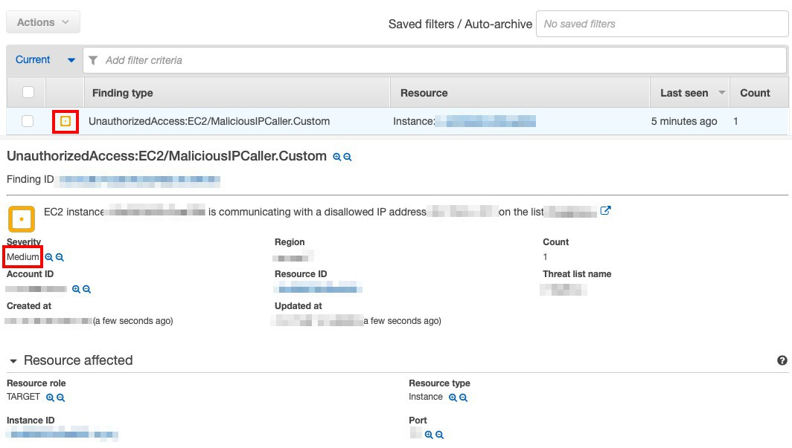
</p>

11. On service menu, select **SNS**.

12. Choose **Create Topic**, enter your Topic Name and Display Name as `SNS-FromGuardDuty` and create.

13. Select the topic you created and **Subscribe to topic** in Actions.
    * Choose `E-mail` in protocol menu
    * Enter  `your email` in Endpoint and click **create**
    > Replace your email with the one you want to receive notification
<p align="center">
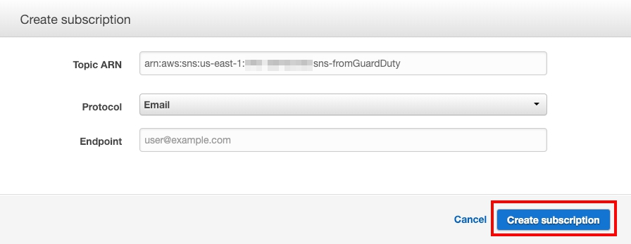
</p>

14. You will receive verify email after few minutes and click **Confirm Subscription**.

<p align="center">
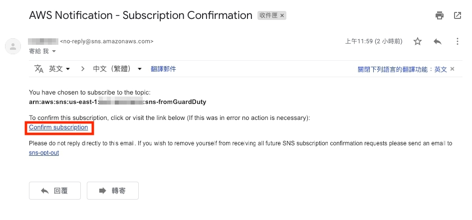
</p>

15. On Service menu, select **IAM**

16. On the left panel, choose **roles** and **Create**.

17. choose AWS Service, lambda and **click Next:Permission** 

18. Search`AWSLambdaBasicExecutionRole` and select it.

19. Click **Next:Tag**, Review, enter role name : `GuardDuty-Finding-ToSNS-yourname` and click create.
    
20. select the role you created and click **Add Inline policy**

    ```
    {
    "Version": "2012-10-17",
    "Statement": 
        [
        {
            "Sid": "VisualEditor0",
            "Effect": "Allow",
            "Action": "sns:Publish",
            "Resource": "<ARN-OF-YOUR-SNS-TOPIC>"
        }
        ]
    }
    ```
    > Note : <ARN-OF-YOUR-SNS-TOPIC\> are Topic ARN you created。

21. Click **Review policy**,and **Create**
    * Name: **GuardDuty-Finding-ToSNS-Policy** 

22. On Service menu, select **Lambda**.

23. On the left panel choose **Functions** and Create Function 

24. Choose **Author from scratch**.    
    * Enter `GuardDuty-To-SNS-yourname` in Name
    * Select Run time with python 3.6
    * Select Role with Choose an existing role
    * Select Existing role with**GuardDuty-finding-SNS-yourname**(role you created)

25. Input code
    * code reference:[Serverless-GuardDuty-to-SNS](https://github.com/miztiik/Serverless-GuardDuty-Findings-to-SNS/blob/master/Serverless-GuardDuty-Findings-To-SNS.py)

<p align="center">
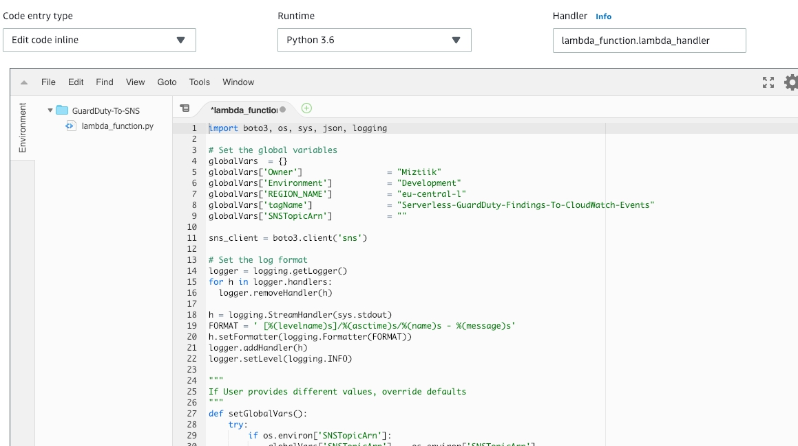
</p>

26. In **Environment variables**.
    * Enter Key with`SNSTopicArn`
    * Enter Value with : `arn:aws:iam::XXX19643XXXX:role/GuardDuty-finding-SNS`（Your Topic ARN）

27. Click **Save**.

28. On the Service menu, click **Cloudwatch**

29. On the left panel click **rule** and Create role

30. Click **Event Pattern**
    * Select Service Name with GuardDuty
    * Select Event Type with GuardDuty Finding
    * click Add Target
    * Select Function with GuardDuty-To-SNS-yourname

<p align="center">
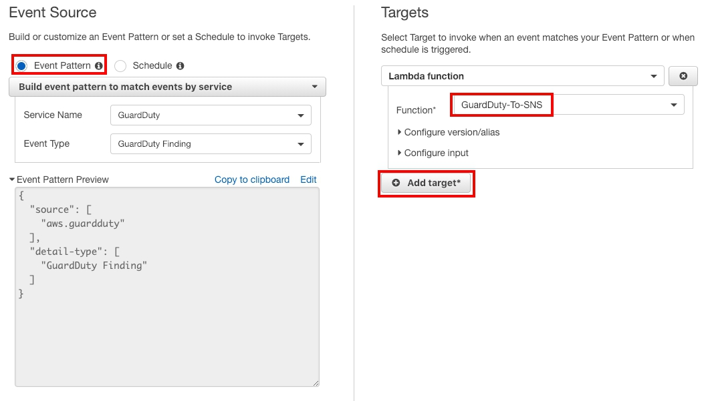
</p>

31. click **Configure details**

32. Configure rule details：
    * Name : `GuardDuty-to-SNS-Rule`
    * State : make sure enabled is checked
    * click Create rule

33. log in your email, you are going to receive notifications


<p align="center">
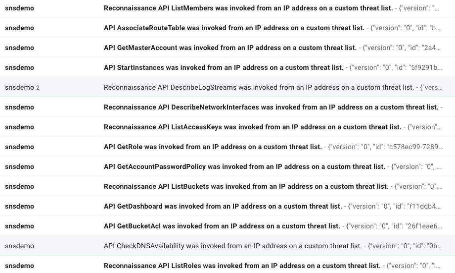
</p>    

Open the email and you will see more details about this notification.

<p align="center">
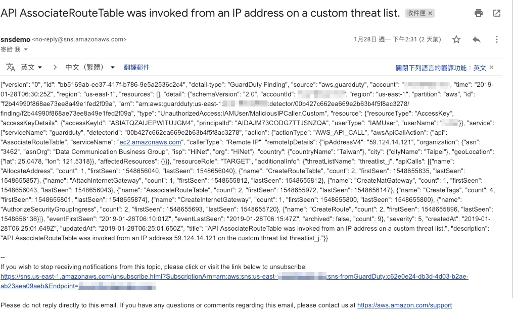
</p>

## Conclusion
Congratulations! We now have learned how to:
* Setup the **GuardDuty**.
* Integrate Amazon Lambda, Cloudwatch, SNS and GuardDuty.

## Ongoing
[EBS Encryption with AWS KMS](/03GuardDutytoSNSandEBSencryption/02EBSencryption/README.md)