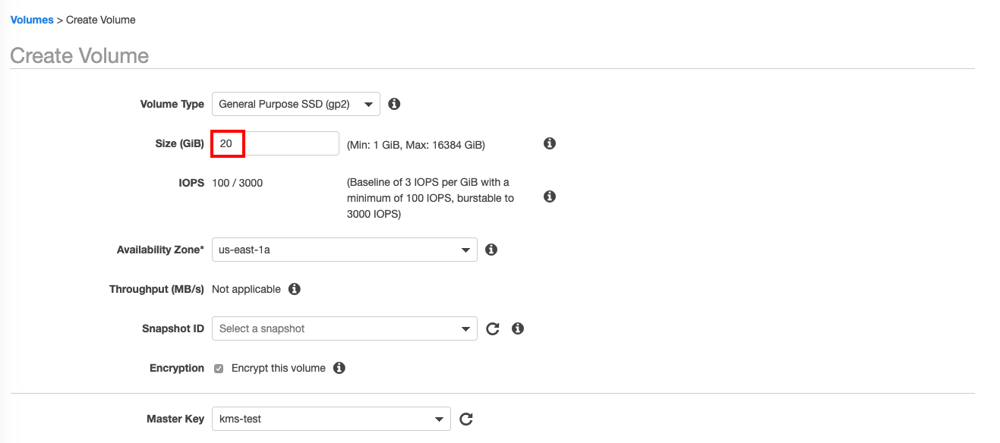

# EBS Encryption with AWS KMS

[AWS KMS](https://aws.amazon.com/tw/kms/) is a managed service that makes it easy for you to create and control the encryption keys used to encrypt your data. AWS KMS is integrated with most other AWS services that encrypt your data with encryption keys that you manage. 

## About this lab

### Scenario
In this lab, you will use AWS KMS to encrypt your EBS at rest.


## Prerequisites
* Make sure you are in **US East (N. Virginia)**, which short name is **us-east-1**.

## Lab tutorial

1. On the service menu, select **KMS**.

2. On the left panel, click **Customer managed keys** and **Create key**.

<p align="center">

</p>

3. In **Add alias and description** enter the following information and **Next**.
    * Alias : key_yourname
    > Replace **yourname** with your name. 

4. **Next** and in Key administrators select **you** as key administrator.
    > You can find *you* on the top of the page.
<p align="center">

</p>

5. **Select** the checkbox : Allow key administrators to delete this key.

6. **Next** and in Define key administrative permissions select **you**.

7. **Next** and Review and edit key policy and modify it.
> Replace <user\> as below.
<p align="center">

</p>

```
{
    "Id": "key-consolepolicy-3",
    "Version": "2012-10-17",
    "Statement": [
        {
            "Sid": "Enable IAM User Permissions",
            "Effect": "Allow",
            "Principal": {
                "AWS": "arn:aws:iam::242196433183:<user>"
            },
            "Action": "kms:*",
            "Resource": "*"
        },
        {
            "Sid": "Allow use of the key",
            "Effect": "Allow",
            "Principal": {
                "AWS": "arn:aws:iam::242196433183:user/<user>"
            },
            "Action": [
                "kms:Encrypt",
                "kms:Decrypt",
                "kms:ReEncrypt*",
                "kms:GenerateDataKey*",
                "kms:DescribeKey"
            ],
            "Resource": "*"
        },
        {
            "Sid": "Allow attachment of persistent resources",
            "Effect": "Allow",
            "Principal": {
                "AWS": "arn:aws:iam::242196433183:user/<user>"
            },
            "Action": [
                "kms:CreateGrant",
                "kms:ListGrants",
                "kms:RevokeGrant"
            ],
            "Resource": "*",
            "Condition": {
                "Bool": {
                    "kms:GrantIsForAWSResource": "true"
                }
            }
        }
    ]
}
```

> Remember to replace <*user*> with your IAM role.

> You can find your IAM role here:
<p align="center">
   
</p>


8. **Finish**.

9. On the service menu, click **EC2**.

10. On the left panel, select **Create Volume**.

11. Eneter the following details and click **Create Volume**.
    * Volume Type : Select **General Purpose SSD(gp2)**
    * Size (GiB) : `20`
    * Availability Zone* : us-east-1a
    * Add Tag : 
        * Key : `Name`
        * Value : `volume not encrypt`

12. Create another volume encrypted and enter following details and click **Create Volume**.
    * Volume Type : Select **General Purpose SSD(gp2)**
    * Size (GiB) : `20`
    * Availability Zone* : us-east-1a
    * Encryption : **check** Encrypt this volume
    * Add Tag : 
        * Key : `Name`
        * Value : `encrypt volume
    * Master Key`: **Select the key you created**

<p align="center">

</p>

13. Select volumes just created and click **Actions** and **Attach Volume** -> two times.

14. Enter the following details and **Attach**.
    * Instance: select the EC2 in the previous lab.

15. You can restart the instance now.

### Test the EBS encrypt volume

1. On EC2 Console, stop the instance.

2. Go to KMS Console and select the key just created and in key policy, click **Edit**.

```
{
    "Id": "key-consolepolicy-3",
    "Version": "2012-10-17",
    "Statement": [
        {
            "Sid": "Enable IAM User Permissions",
            "Effect": "Allow",
            "Principal": {
                "AWS": "arn:aws:iam::242196433183:<user>"
            },
            "Action": "kms:*",
            "Resource": "*"
        },
        {
            "Sid": "Allow use of the key",
            "Effect": "Allow",
            "Principal": {
                "AWS": "arn:aws:iam::242196433183:user/<user>"
            },
            "Action": [
                "kms:Encrypt",
                "kms:Decrypt",
                "kms:ReEncrypt*",
                "kms:GenerateDataKey*",
                "kms:DescribeKey"
            ],
            "Resource": "*"
        },
        {
            "Sid": "Allow attachment of persistent resources",
            "Effect": "Allow",
            "Principal": {
                "AWS": "arn:aws:iam::242196433183:user/<user>"
            },
            "Action": [
                "kms:CreateGrant",
                "kms:ListGrants",
                "kms:RevokeGrant"
            ],
            "Resource": "*",
            "Condition": {
                "Bool": {
                    "kms:GrantIsForAWSResource": "true"
                }
            }
        }
    ]
}
```

> *Note* : This time, replace **other user** in your account !!!!! You can find other user in IAM Service.

> You can find your IAM role here:
<p align="center">
   
</p>


3. **Save changes**.

4. On Service menu, click **EC2**.

5. Select your **EC2**, click **Actions** -> Instance State -> **Start**.

6. You will find out your EC2 **cannot** running again. It is because you do not have key permission now, so you cannot decrypt the EBS.

7. On the left panel, select **Volume** and **Create Volume**.

8. Eneter the following details and click **Create Volume**.
    * Volume Type : Select **General Purpose SSD(gp2)**
    * Size (GiB) : `20`
    * Availability Zone* : us-east-1a
    * Encryption : **check** Encrypt this volume
    * Add Tag : 
        * Key : `Name`
        * Value : `encrypt volume
    * Master Key`: **Select the key you created**

9. **Create Volume**.

12. You will see error messages like this :  
> Because you has no permission for Key, so it will pop up error messages.
<p align="center">
   
</p>


## Conclusion
Congratulations! We now have learned how to:
* Use KMS encrypt your EBS volume

